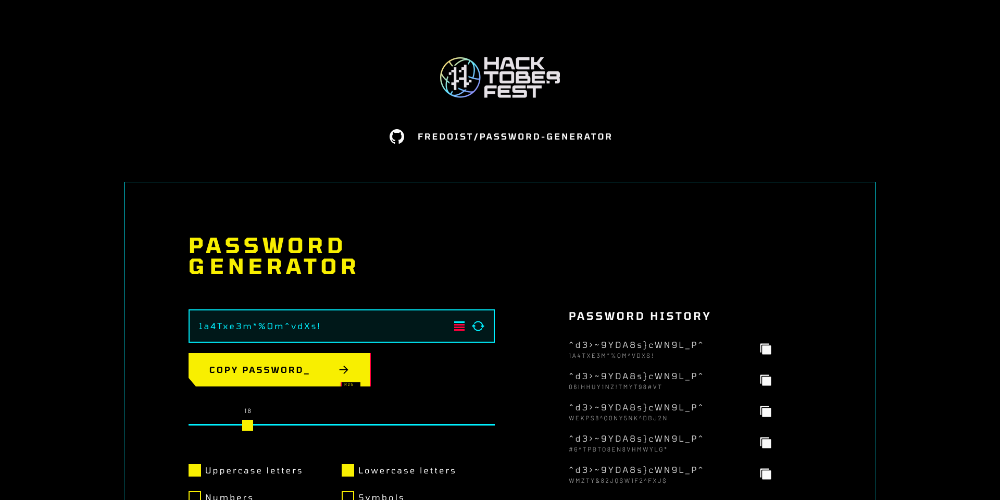

<a href="https://github.com/fredoist/password-generator">
  
</a>
<br />
<h3 align="center">Password Generator</h3>
<p align="center">
  Cyberpunk-themed Password Generator built using Astro and Svelte
</p>
<br />
<p align="center">
  <a href="https://twitter.com/fredoist"></a>
  &nbsp;
  <a href="https://www.linkedin.com/in/alfredogonzalezr"></a>
  &nbsp;
  <a href="https://www.figma.com/community/file/1167934186210755390"></a>
  &nbsp;
  <a href="https://github.com/fredoist/password-generator/stargazers"></a>
  &nbsp;
  <a href="https://github.com/fredoist/password-generator/blob/main/LICENSE"></a>
  &nbsp;
  <a href="https://cyberpassword.surge.sh"></a>
  &nbsp;
</p>

## About the project

A hackathon project built for the Hacktoberfest 2022 event by [midudev](https://github.com/midudev). The project was inspired by the recent release of Cyberpunk: Edgerunners on Netflix.

## Features

The main hackathon requirements were to create a password generator that included a slider for password length and a copy button. My hackathon entry included the following features:

- Randomly generate a password.
- Change the desired password length, which is set to 18 characters by default.
- Set the characters to include in the password, such as lowercase letters, uppercase letters, numbers, and symbols.
- View password strength as you generate it.
- Log of previously generated passwords.
- Keyboard shortcuts for key features.
- Ambient sound and animations.

## Built using

[](https://astro.build)
[](https://svelte.dev)
[](https://tailwindcss.com)

## Get started

To get started, clone the repository and install the dependencies:

```bash
git clone https://github.com/fredoist/password-generator.git
cd password-generator
pnpm install
```

Run the development server:

```bash
pnpm run dev
```

## Contribute

This project is not accepting PRs at the moment, but you can always [open an issue](https://github.com/fredoist/password-generator/issues/new) if you find a bug.
